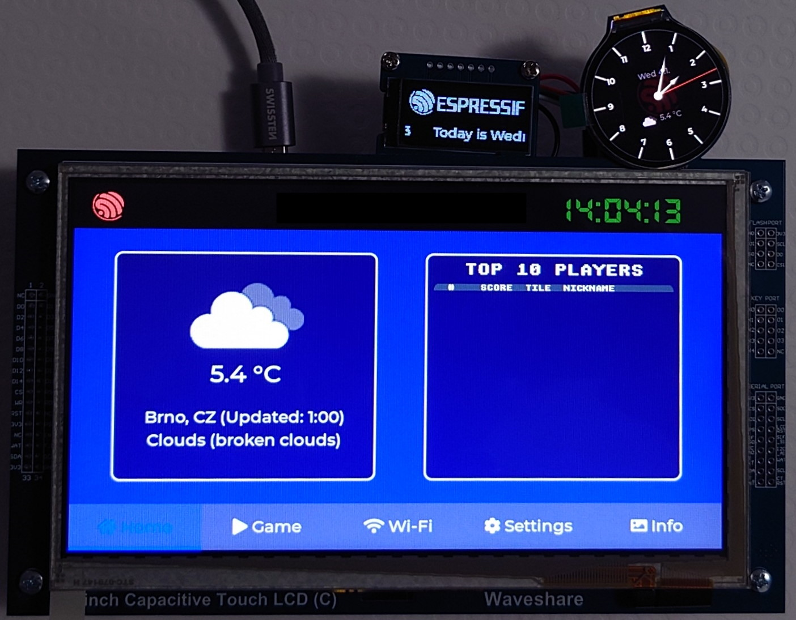

| Supported Targets | ESP32-S3 |
| ----------------- | -------- |


# Multiple LCD Display Example

This example shows handling multiple LCD displays with touch from one MCU. It shows time synchronized with SNTP server and weather synchronized with https://openweathermap.org/. It allows search WiFi networks and connect to selected. It can change the weather place, weather update interval and time zone. All settings are saved into NVS and loaded after each restart.

There is used LVGL as a graphic library.

This example contains the 2048 Game, which was used from https://github.com/100askTeam/lv_lib_100ask.



## Supported graphical controllers

- [x] GC9A01 (SPI)
- [x] ST7789 (SPI)
- [x] NT35510 (SPI)
- [x] SH1107 (I2C)
- [x] RA8875 (Parallel Intel 8080)
- [x] RM68120 (Parallel Intel 8080)

## Supported touch controllers

- [x] FT5x06 (I2C)
- [x] GT911 (I2C)
- [x] TT21100 (I2C)

## Tested displays with this example

* Waveshare 800x480 7" LCD with Capacitive Touch
    * LCD controller: RA8875, Touch controller: GT911
    * Buy: https://www.waveshare.com/7inch-capacitive-touch-lcd-c.htm
    * Wiki: https://www.waveshare.com/wiki/7inch_Capacitive_Touch_LCD_(C)
* Waveshare 240x240 1.28" Round LCD
    * LCD controller: GC9A01
    * Buy: https://www.waveshare.com/1.28inch-lcd-module.htm
    * Wiki: https://www.waveshare.com/wiki/1.28inch_LCD_Module
* Waveshare 64×128 1.3" OLED
    * LCD controller: SH1107
    * Buy: https://www.waveshare.com/1.3inch-oled-module-c.htm
    * Wiki: https://www.waveshare.com/wiki/1.3inch_OLED_Module_(C)
* ESP32-S2-HMI-DevKit-1 V1.0 480×800 4.3" 
    * LCD controller: RM68120, Touch controller: FT5x06
    * Guide: https://docs.espressif.com/projects/espressif-esp-dev-kits/en/latest/esp32s2/esp32-s2-hmi-devkit-1/user_guide.html
* ESP-BOX
    * LCD controller: ST7789, Touch controller: TT21100
    * Guide: https://github.com/espressif/esp-box

## How to use the example

### Hardware Required

* An ESP development board **ESP32-S3-DevKitC-1 v1.0**
* An USB cable for power supply and programming
* One parallel (Intel 8080) display
* One serial (SPI) display
* One monochromatic (I2C) display

## Recommended hardware Connection

Recommended connection is on schematic or saved in board files here: [main/board](main/board).


### Menuconfig settings

Before compiling and flash the project, you should set up it:

```
idf.py menuconfig
```

* Set timezone: Go to **Multiple LCD Example Configuration->Time Configuration** and set **Time zone TZ string**
* Set API key for openweathermap.org: Go to **Multiple LCD Example Configuration->Weather Configuration** and set **OpenWeatherMap API key** [^1]

[^1]: For get the API key, please register at https://openweathermap.org/.

### Build a flash

```
idf.py -p COMx flash monitor
```

### Use

* Connect to Wi-Fi on **Wi-Fi** tab (saved into NVS)
* Set weather place on **Settings** tab (saved into NVS)
* Look at time on top and on the round display
* Look at the weather on the **Home** tab
* Play the 2048 Game on **Game** tab

# Flash latest binary from browser

<a href="https://espressif.github.io/esp-launchpad/?flashConfigURL=https://espzav.github.io/Multiple-LCD-Demo/tools/launchpad.toml">
    
</a>


